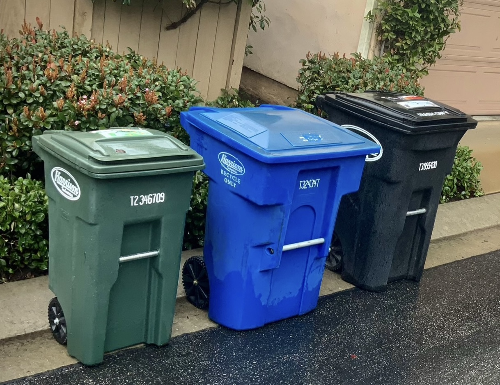

# University Glen Bins: Trash Bin Services

## About Us
Hi, I'm **Ewan Isaacs**, and I live right here in University Glen. I started **University Glen Bins**,  because I understand the hassle of managing your trash, recycling, and green waste bins. That's why I offer a convenient service to take your bins out on Mondays and bring them back to your patios on Tuesday. Say goodbye to those early morning curb runs!

## Service Details
- **Service Days**: **Mondays (take bins out)** and **Tuesdays (bring bins back)**.
- **Cost**: Only **$4 per week for trash, recycling, and green waste**. And only **$3 per week for seniors for trash, recycling, and green waste**.
- **My Mission**: To help save you **time** and **pain** for an **affordable price**.
- **Weather**: I will work **rain or shine for the same price**.
- **Payment method**; I accept payment in the form of **cash and venmo**.
- **First week is **50% off** when you email me **"Garbage Bins"** in the headline of your email.

## How it Works 
**You will email me your adress, the money in the form of venmo (In the email) or cash (when I get there). Use the code "garbage bins" in the headline of your email to get 50% off if you are new**. Then I will come to your house on Monday from **8am to 7pm** to take your garbage cans out then from **9:30am to 8pm** on Tuesday to put them back in your patio/garbage bin area. If I am univalible **(For instance on vacation)** I will refund you with venmo and you will take your cans out. The monthly fee is **$12 a month** or **$10 a month for 50 and older**.   

## Contact Us
Have questions or want to sign up? Reach out to me at **universityglenbins@gmail.com**

